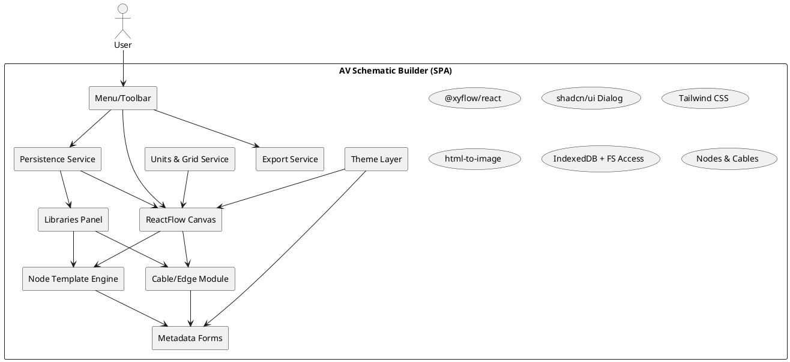
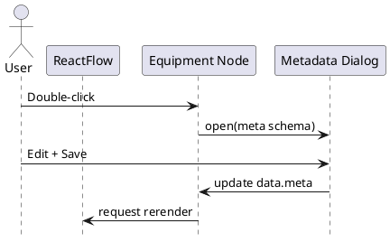

# SPEC-1-AV Schematic Builder

## Background

- Build a React app for audiovisual schematic diagrams using a graph editor.
- A single base **equipment node** component is cloneable and configurable: resizable rectangle, left inputs/right outputs, selectable connector types (HDMI, SDI, SERIAL, etc.), centered short label (e.g., VS-01). Double‑click opens a metadata form matching the provided examples.
- **Cables** are graph edges showing signal flow. Each edge has a metadata form on double‑click and displays cable type text (e.g., 222C, 162C) inline.
- **Editor features**: new/open/save to disk, close with unsaved prompt, export to PNG or SVG, infinite canvas, zoom controls, snap‑to‑grid with editable spacing and switchable units (px, mm, inch).
- **Themes**: light and dark with a neon‑blue accent for a futuristic look.
- **Libraries**: user‑defined node templates and cable templates, saved for reuse across diagrams.
- **Future**: drag‑and‑drop BOM table for equipment (columns: MANUFACTURER, MODEL, PN, QTY) and a cable‑pull schedule table derived from edges.

## Requirements

### Must‑have
- Base equipment node with configurable connectors (inputs left, outputs right), centered label, resize, duplicate.
- Edge cables with inline type label and double‑click metadata modal.
- Double‑click metadata modal for nodes with fields per screenshots.
- Connection validation by connector type (e.g., HDMI↔HDMI, block mismatched types if configured).
- Infinite canvas, zoom in/out, pan.
- Snap‑to‑grid with editable spacing and units: px, mm, inch.
- New/Open/Save/Close with unsaved‑changes prompt using local filesystem; JSON diagram format.
- Export canvas to PNG and SVG.
- Light/Dark theme with neon‑blue accent.
- Node Library and Cable Library persisted locally (IndexedDB) with create/update/delete and drag‑to‑canvas.

### Should‑have
- Import/Export libraries and diagrams as JSON bundles.
- Keyboard shortcuts (copy, paste, duplicate, delete, zoom, snap toggle, save).
- Template‑driven metadata schemas with validation.
- Search/filter in libraries.
- Print layout with scale.

### Could‑have
- Connector palettes per standard (HDMI, SDI, RS‑232, USB, Dante) with icons.
- Auto‑layout helpers for vertical connector spacing.
- Theme editor for accent color.
- Edge routing styles (straight, step, smooth) per cable type.

### Won’t‑have (MVP)
- Real‑time multiuser editing.
- Cloud sync.
- Simulation of signal integrity.


## Method

### High-level architecture



### Data model (TypeScript)

```ts
// Shared
export type UUID = string;
export type Unit = 'px' | 'mm' | 'in';
export type ConnectorStandard = string;
export type Direction = 'in' | 'out';

export interface Connector {
  id: UUID;            // stable per port
  label: string;       // e.g., HDMI 1
  standard: ConnectorStandard;
  direction: Direction; // 'in' => target handle, 'out' => source handle
  group?: 'input' | 'output';
}

export interface EquipmentNodeData {
  label: string;        // VS-01
  description?: string; // optional
  meta: Record<string, string | number | boolean | null>; // screenshot fields
  inputs: Connector[];
  outputs: Connector[];
  template?: AppliedTemplateRef; // template snapshot used to instantiate
}

export interface CableMeta {
  ms_cable_label?: string;
  ms_cable_length?: string;
  ms_cable_qty?: string;
  ms_cable_type?: string; // e.g., 222C, 162C, 254246EZ
  tags?: string[];
}

export interface CableEdgeData {
  cableType: string;     // shown as edge label
  meta: CableMeta;
  routing?: 'bezier' | 'step' | 'straight'; // default 'bezier'
  template?: AppliedTemplateRef; // template snapshot used to instantiate
}

export interface Diagram {
  id: UUID;
  name: string;
  nodes: Node<EquipmentNodeData>[]; // @xyflow/react Node type
  edges: Edge<CableEdgeData>[];
  createdAt: number;
  updatedAt: number;
  grid: { snap: boolean; spacing: [number, number]; unit: Unit };
  theme: 'light' | 'dark';
}

export interface NodeTemplate { id: UUID; name: string; data: EquipmentNodeData; tags?: string[]; version?: number; updatedAt?: number; }
export interface AppliedTemplateRef { id: UUID; version?: number }
export interface CableTemplate { id: UUID; name: string; data: CableEdgeData; tags?: string[]; version?: number; updatedAt?: number; }
```

### Local persistence

- **IndexedDB (idb)** DB name: `av-schematic-v1` with object stores:
  - `diagrams` by `id` (indexes: `name`, `updatedAt`)
  - `nodeTemplates` by `id` (index `name`)
  - `cableTemplates` by `id` (index `name`)
- **File I/O** via File System Access API: open/save `.avflow.json` bundles `{ diagram, nodeTemplates[], cableTemplates[] }`.

### Connector registry (user-managed)

- Store entries in IndexedDB `connectorRegistry` as `{ key, color, icon, description, aliases[] }`.
- UI: Settings dialog to add/edit/delete standards and pick color.
- Matching rule: connection valid when source and target standards match after alias resolution and case normalization. No predefined list shipped.

### Core UI composition

- `<ReactFlow>` with:
  - `nodes`, `edges`, `onNodesChange`, `onEdgesChange`, `onConnect`, `onReconnect`.
  - `snapToGrid`, `snapGrid` set by Units & Grid Service.
  - Unbounded canvas by leaving `translateExtent` undefined.
  - Built-ins: `<Background />`, `<Controls />`, optional `<MiniMap />` for navigation.
  - `defaultEdgeOptions`: `{ type: 'cable', markerEnd: { type: 'arrowclosed' } }`.
- **Panels**:
  - Top `Panel` for menu: New, Open, Save, Close, Export PNG/SVG, Zoom controls, Theme toggle, Snap toggle, Grid spacing input, Unit selector, **Edge style selector** (Bezier/Step/Straight).
  - Left Library panel: templates list, drag to canvas to instantiate.

### Base Equipment Node

Layout goals: resizable rectangle; inputs left, outputs right; centered label; multiple connectors; connector handles aligned evenly and stay on their side while resizing.

```tsx
// BaseEquipmentNode.tsx
import { Handle, Position, NodeResizer } from '@xyflow/react';

export default function BaseEquipmentNode({ id, data, selected }: NodeProps<EquipmentNodeData>) {
  return (
    <div className="relative rounded-2xl shadow-lg border neon-node bg-card text-card-foreground">
      <NodeResizer minWidth={160} minHeight={100} isVisible={selected} />
      <div className="grid grid-cols-[auto_1fr_auto] items-stretch min-h-[100px]">
        {/* Inputs */}
        <ul className="flex flex-col justify-stretch gap-2 p-2">
          {data.inputs.map((c, idx) => (
            <li key={c.id} className="relative flex items-center">
              <span className="text-[10px] opacity-70 pr-3">{c.standard}</span>
              <Handle id={c.id} type="target" position={Position.Left} className="absolute -left-2" />
            </li>
          ))}
        </ul>
        {/* Label */}
        <div className="flex items-center justify-center px-3">
          <span className="font-semibold text-center truncate">{data.label}</span>
        </div>
        {/* Outputs */}
        <ul className="flex flex-col justify-stretch gap-2 p-2">
          {data.outputs.map((c) => (
            <li key={c.id} className="relative flex items-center justify-end">
              <Handle id={c.id} type="source" position={Position.Right} className="absolute -right-2" />
              <span className="text-[10px] opacity-70 pl-3">{c.standard}</span>
            </li>
          ))}
        </ul>
      </div>
    </div>
  );
}
```

**Connection validation**

- Store a `portIndex` map in Zustand `{ [nodeId: string]: { [handleId: string]: Connector } }`.
- On each `Handle`, pass `isValidConnection={(conn) => sameStandard(conn) && allowedDirection(conn) }`.
- `sameStandard` compares `source.standard === target.standard` unless project settings allow adapters.

**Duplication**

- `duplicateSelected()` clones selected node(s), offsets by grid spacing, assigns new UUIDs to node and connector ids, and increments trailing digits of the label.
- Label auto‑increment pattern: `{PREFIX}-{NN}` with zero padding supported by default (e.g., `VS-01` → `VS-02`). Falls back to trailing‑digits increment when pattern not matched.
- **Label prefix source**: by default derived from the **Node Template name** used to instantiate the node (e.g., template "VS" → labels `VS-01`, `VS-02`). Per‑node override allowed in metadata.

### Cable edge

- Use a **custom edge type** with inline text label and selectable routing.
- Edge `data` carries `cableType`, `routing`, and full `meta` for dialog.
- Left-to-right flow by convention: outputs on right, inputs on left; arrow marker points to target.

```tsx
// CableEdge.tsx
import { BaseEdge, EdgeLabelRenderer, getBezierPath, getSmoothStepPath, getStraightPath, getStepPath } from '@xyflow/react';

function pathFor(routing: 'bezier'|'step'|'straight', args: any){
  if(routing==='straight') return getStraightPath(args);
  if(routing==='step') return getStepPath({ ...args, borderRadius: 8 });
  return getSmoothStepPath({ ...args, borderRadius: 6 }); // bezier-like smooth
}

export default function CableEdge(props: EdgeProps<CableEdgeData>) {
  const { id, sourceX, sourceY, targetX, targetY, sourcePosition, targetPosition, data } = props;
  const routing = data?.routing ?? 'bezier';
  const [path, labelX, labelY] = pathFor(routing, { sourceX, sourceY, targetX, targetY, sourcePosition, targetPosition });
  const text = data?.meta?.ms_cable_label ? `${data.meta.ms_cable_label} · ${data.cableType}` : data?.cableType;
  return (
    <>
      <BaseEdge id={id} path={path} />
      <EdgeLabelRenderer>
        <div style={{ position: 'absolute', transform: `translate(-50%, -50%) translate(${labelX}px,${labelY}px)` }} className="pointer-events-auto select-none text-[10px] px-1.5 py-0.5 rounded bg-muted/70 border backdrop-blur">
          {text}
        </div>
      </EdgeLabelRenderer>
    </>
  );
}
```

**Orientation checks**

- In `onConnect`, validate `sourceHandle` belongs to an output and `targetHandle` to an input.
- Optionally warn if `sourceX > targetX` to keep visual left→right convention.

### Metadata forms

- **Double-click** on node/edge opens a shadcn/ui `Dialog` with a form built from a JSON schema per type.
- Submit updates node `data.meta` or edge `data.meta`.

#### Example JSON schema for a device

```json
{
  "$schema": "https://json-schema.org/draft/2020-12/schema",
  "title": "EquipmentMeta",
  "type": "object",
  "properties": {
    "ms_device_description": { "type": "string" },
    "ms_device_id": { "type": "string" },
    "ms_device_location": { "type": "string" },
    "ms_device_mfr": { "type": "string" },
    "ms_device_model": { "type": "string" },
    "ms_device_mount": { "type": "string" },
    "ms_device_note": { "type": "string" },
    "ms_device_number": { "type": "string" },
    "ms_device_qty": { "type": "string" },
    "tags": { "type": "string" }
  }
}
```

#### Example JSON schema for a cable

```json
{
  "$schema": "https://json-schema.org/draft/2020-12/schema",
  "title": "CableMeta",
  "type": "object",
  "properties": {
    "ms_cable_label": { "type": "string" },
    "ms_cable_length": { "type": "string" },
    "ms_cable_qty": { "type": "string" },
    "ms_cable_type": { "type": "string" },
    "tags": { "type": "string" }
  }
}
```

### Units and snapping

- Internal unit is **px**; convert for UI using `1 in = 96 px`, `1 mm = 96 / 25.4 px`.
- Grid snap uses React Flow `snapToGrid` and `[x,y]` spacing; the service converts UI-selected units to px and sets `snapGrid`.
- Leave `translateExtent` undefined to keep panning effectively unbounded.

### Theme

- Tailwind config adds CSS variables and a neon‑blue accent.

```ts
// tailwind.config.ts excerpt
export default {
  theme: {
    extend: {
      colors: {
        neon: {
          500: '#33B1FF', // accent
        },
      },
      boxShadow: {
        neon: '0 0 12px rgba(51,177,255,0.6)'
      }
    }
  }
}
```

```css
/* node aesthetics */
.neon-node { border-color: theme('colors.neon.500'); box-shadow: theme('boxShadow.neon'); }
```

### Libraries (templates)

- **Node Library**: save any selected node as a `NodeTemplate`. Normalize position, drop runtime-only fields. Drag from library to canvas to instantiate.
- **Cable Library**: save any selected edge as a `CableTemplate`. Drag to create an edge; on drop, prompt for endpoints, or create as a floating cable awaiting connection.
- **Template semantics**: templates are **versioned snapshots**. Editing a template does not auto‑change existing nodes/edges.
- **Apply Template Updates**: action to re‑apply a chosen `templateId@version` to selected nodes/edges.
  - Remap edges on replace using:
    1) **Strict match** by `PORTID = <nodeId>.<side>.<standard>.<index>`.
    2) **Fallback** by tuple `(side, standard, index)`.
    3) Otherwise detach edge with a warning list.
- **Versioning**: `NodeTemplate` and `CableTemplate` include `version` and `updatedAt`. Each node/edge stores `template: { id, version }`.

### Connectors editor

- Side-panel for selected node:
  - Separate **Inputs** and **Outputs** lists with reorder (↑/↓), add/remove, and field edit.
  - Stable IDs preserved on reorder.
  - Removing a port detaches any connected edges with confirmation.

### Export

- **PNG** and **SVG** via `html-to-image`.
- **Page frame overlay**: selectable paper size (Letter, Tabloid, A4, A3), orientation, margins (inches), and DPI. Centered guide on canvas. Pan/zoom canvas to compose inside frame.
- **PNG export crops to frame** at chosen DPI. SVG exports the full canvas (frame ignored for now).
- Optional metadata footer can be added later.

### Menu logic

- **New**: if dirty, show unsaved prompt; then clear canvas and reset state.
- **Open**: pick `.avflow.json`, load, and hydrate state.
- **Save**: write current diagram bundle.
- **Close**: prompt if dirty, then clear state to a blank canvas.
- **Zoom**: programmatic calls via `useReactFlow()` instance.
- **Edge style**: toolbar selector sets global default; per‑edge override stored in `edge.data.routing`.

### User flows




## Implementation

### 0) Project setup

```bash
pnpm create vite av-schematic --template react-ts
cd av-schematic
pnpm add @xyflow/react zustand idb html-to-image classnames
pnpm add tailwindcss postcss autoprefixer -D
pnpm add zod react-hook-form @hookform/resolvers
# shadcn/ui setup (or copy prebuilt UI components)
```

Configure Tailwind and dark mode via class on `<html>`.

### 1) Types and schema

- Add `src/types.ts` with interfaces from Method section.
- Add `src/schema/deviceMeta.ts` and `src/schema/cableMeta.ts` as Zod schemas mirroring screenshot fields.

### 2) State management (Zustand)

- `useDiagramStore`: nodes, edges, grid, theme, dirty flag, helpers `addNode`, `updateNode`, `addEdge`, `updateEdge`, `duplicateSelected`, `deleteSelected`, `setTheme`, `setGrid`.
- `useLibraryStore`: nodeTemplates, cableTemplates, connectorRegistry with CRUD and import/export.

### 3) Canvas

- `App.tsx` renders `<ReactFlow>` with custom node type `equipment` and edge type `cable`.
- Add `<Background variant="dots" />` and `<Controls />`.
- `defaultEdgeOptions`: `{ type: 'cable', markerEnd: { type: 'arrowclosed' } }`.
- Connect `onConnect` to create `CableEdgeData` with default `{ cableType: '', meta: {}, routing: 'bezier' }`.
- `onEdgeDoubleClick` and `onNodeDoubleClick` open dialogs.

### 4) Base node and custom edge

- Implement `BaseEquipmentNode` and `CableEdge` as in Method.
- Register types: `nodeTypes={{ equipment: BaseEquipmentNode }}` and `edgeTypes={{ cable: CableEdge }}`.

### 5) Metadata dialogs

- `DeviceMetaDialog.tsx` and `CableMetaDialog.tsx` using shadcn/ui `Dialog` + React Hook Form.
- Map Zod schema to inputs. Persist back to `data.meta`.

### 6) Connector registry

- Settings dialog to manage standards list with color and aliases.
- Validation function `registryMatch(connection)` resolves aliases then strict‑matches strings.

### 7) Libraries panel

- Left dock with tabs **Nodes** and **Cables**.
- Each template card supports drag‑start payload. On drop over canvas, instantiate node or start a pending edge.
- Persist templates and registry to IndexedDB.

### 8) Menu/Toolbar

- New, Open, Save, Close wired to FS Access API.
- Export to PNG/SVG via `html-to-image`.
- **Page frame** toggles paper size, orientation, margins, and DPI. Export crops to frame.
- Zoom in/out via `useReactFlow().zoomIn/zoomOut`.
- Snap toggle, spacing inputs, and unit selector bound to `useDiagramStore`.
- Edge style selector sets global default; per-edge override in `edge.data.routing`.

### 9) Units service

- Internal unit is **px**; convert for UI using `1 in = 96 px`, `1 mm = 96 / 25.4 px`.
- Grid snap uses React Flow `snapToGrid` and `[x,y]` spacing; the service converts UI-selected units to px and sets `snapGrid`.
- Default on first load: **unit = mm** with **grid spacing = 10 mm**, i.e., ≈ **37.80 px** per step.
- Leave `translateExtent` undefined to keep panning effectively unbounded.

### 10) Label increment and duplication

- Supports `{PREFIX}-{NN}` with zero padding by default. Example: `VS-01` → `VS-02`.
- Fallback: increment any trailing digits while preserving width.
- Label prefix derives from Node Template name by default. Per-node override allowed.
- **Auto-suggest on instantiate**: when dropping a node from a template, scan existing labels with same prefix and assign the next series value.
- When duplicating nodes, offset by current grid spacing and ensure no id collisions.

### 11) Shortcuts) Shortcuts

- `Ctrl/Cmd+S` Save, `Ctrl/Cmd+O` Open, `Ctrl/Cmd+N` New, `Ctrl/Cmd+E` Export, `Esc` close dialogs, `Del` delete selected, `Ctrl/Cmd+D` duplicate, `+/-` zoom.

### 12) Serialization format

- Single bundle file extension `.avflow.json` containing diagram + libraries + connector registry.

```json
{
  "diagram": {"id":"...","name":"...","nodes":[],"edges":[],\"grid\":{\"snap\":true,\"spacing\":[10,10],\"unit\":\"mm\"},"theme":"dark"},
  "nodeTemplates": [],
  "cableTemplates": [],
  "connectorRegistry": {},
  "librariesVersion": 1
}
```

### 13) Theme and styling

- Tailwind tokens with neon accent. Dark mode default. Add subtle glow on selected nodes/edges.

### 14) Testing smoke paths

- Create two nodes with HDMI in/out. Connect, edit metadata, export PNG, save, close, reopen, and verify registry and libraries persist.

## Milestones

- **M0**: Project scaffold, Tailwind, dark/light theme switch.
- **M1**: Canvas running with custom equipment node, resize, handles left/right.
- **M2**: Custom cable edge with arrowheads, label `ms_cable_label · type`, routing options.
- **M3**: Metadata dialogs for nodes and edges with Zod validation.
- **M4**: Connector registry settings and validation.
- **M5**: Node and Cable libraries with drag-to-canvas and persistence.
- **M6**: Menu: New/Open/Save/Close; dirty prompt; local file I/O.
- **M7**: Export PNG/SVG + page frame print options (PNG crops to frame; SVG full canvas).
- **M8**: Units and snap grid with px/mm/in conversion.
- **M9**: Shortcuts and polish; QA smoke tests.
- **M10 (Future)**: BOM table, Cable Pull schedule, and **auto-suggest series for cables per type** with CSV/JSON export.

## Gathering Results

- **Functional checks**: create/duplicate nodes; enforce connector matching; left→right edge orientation; metadata dialogs open on double‑click; libraries persist across reloads.
- **Export checks**: PNG/SVG match canvas; page frame crop correct at chosen DPI; fonts render.
- **Performance**: target 60fps pan/zoom with 200 nodes and 300 edges on mid‑tier laptop; measure render timings.
- **Persistence**: re‑open saved `.avflow.json` equals in‑memory state; template import/export round‑trips.
- **Unit accuracy**: grid snapping distances verified with conversions; tolerance ±1 px.
- **User acceptance**: build two sample diagrams and confirm menu and libraries meet workflow needs.

## Need Professional Help in Developing Your Architecture?

Please contact me at [sammuti.com](https://sammuti.com) :)

